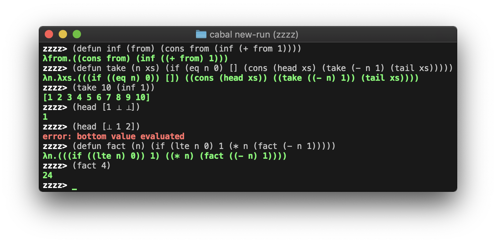

<h1 align="center">zzzz</h1>

A non-strict, dynamically typed lisp, which compiles to lambda calculus.

<p align="center">
    
</p>

## Examples

```
zzzz> (defun foldr (f i xs)
zzzz|   (if (eq xs [])
zzzz|     i
zzzz|     (f (head xs) (foldr f i (tail xs)))))
λf.λi.λxs.(((if ((eq xs) [])) i) ((f (head xs)) (((foldr f) i) (tail xs))))

zzzz> (foldr + 0 [1 2 3])
6
```
 > Higher-order functions and currying (of the `+` function).

```
zzzz> (defun repeat (x)
zzzz| (cons x (repeat x)))
λx.((cons x) (repeat x))

zzzz> (defun take (n xs)
zzzz|   (if (eq n 0)
zzzz|     []
zzzz|     (cons (head xs) (take (- n 1) (tail xs)))))
λn.λxs.(((if ((eq n) 0)) []) ((cons (head xs)) ((take ((- n) 1)) (tail xs))))

zzzz> (take 10 (repeat 0))
[0 0 0 0 0 0 0 0 0 0]
```

 > Lazy data structures. In this case, taking the first 10 elements of an infinite list of zeros.